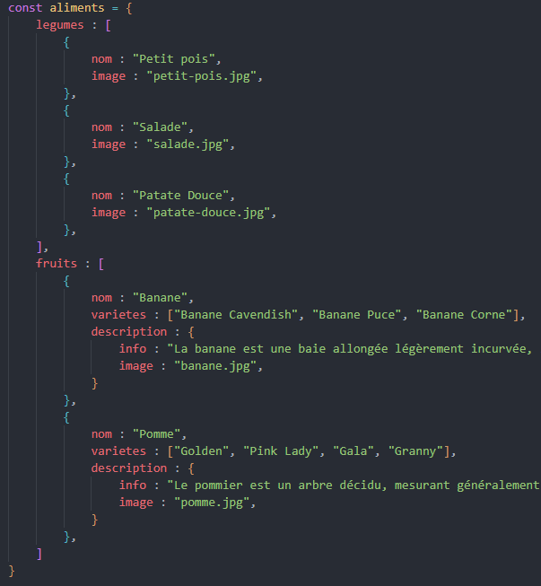

Pour revenir sur la correction `légumes` : [Correction légumes](./Correction-legumes-exercice01.md)

# Correction partie Fruits

Comme dans la précédente correction, on va prendre l'exemple de la `banane` pour plus de facilité.

Je ne vais pas tous détailler, surtout qu'il y a une partie similaire à celle de `legumes`, si vous en êtes là, s'est que vous savez au moins cibler/créer un élément dans le DOM.

Je vais m'attarder surtout sur les deux "nouveautés", *le nouveau chemin de l'image* et *la boucle*.

Pour l'image effectivement, il y avait un petit "piège", pas non plus hyper dur mais tu as dû voir qu'il fallait à la fois gérer l'élément de l'objet et le chemin du `.src`.

Reprenons notre image du fichier `data.js` :

Le chemin a l'air plus "compliqué" et pourtant non, il est simplement plus "long".

Si on suit les miettes du petit poucée, on obtient :

`aliments` > `fruits` > `index de fruits` > `description` > `image`

Ce qui nous donne : 

`aliments.fruits[0].description.image`

Mais si on note ça directement dans notre valeur de `innerText` il ne trouvera rien, ou renverra une erreur "404" en console.

J'ai laissé de façon intentionnelle le `.jpg` pour voir si tu tomberais dans le piége, car on en oublie des fois se qu'il y a avant.

Si on regarde où se trouve notre image de `banane`, elle se trouve dans un dossier `assets` qui lui-même a un dossier `img`.

Donc il y a de deux façons de procédés, une concaténation classique avec le `+` ou celle avec les `back ticks`. Je mets les deux façons ici :

*Info : `imgBanane` est la variable de l'image que l'on a créé `img` pour cette partie la `fruits`, et que l'on a dû ajouter dans la `

` prévu à cet effet*

`imgBanane.src = "../assets/img/" + aliments.fruits[0].description.image;`

**Ou** 

*Info : j'ai dû mettre des guillemets simple ' ' au lieu des back ticks ` qui sont déjà utilisés par le langage markdown. Vous avez donc juste à les remplacer.*

`imgBanane.src = '../assets/img/${aliments.fruits[0].description.image}'`

> Super !! je vois mon image en faisant des deux manières.

Passons à cette fameuse petite boucle ;)

Dans notre fichier `data.js`, on voit que `varietes` possède un tableau, donc on sait qu'on va devoir boucler dessus pour récupérer chaque nom de variétés.

Si on décompense le chemin ça donne :

`aliments` > `fruits` > `index fruits` > `varietes`

Rien de compliqué, donc on va ajouter ça en condition de notre boucle en précisant la longueur de notre tableau :

`for(i = 0; i < aliments.fruits[0].varietes.length; i++)`

Bon, une bonne chose de moins à faire, maintenant reste à savoir se qu'on doit intégrer dedans.

Je vois dans le HTML qu'on cible un `ul`, et on sait qu'un `ul` en HTML contient des ... `li`

Je sais que l'on doit donc créer une balise `li` 

> Euh ... tu veux dire DES balises li non ? 

Oui, vu qu'il y a plusieurs éléments dans le tableau de `varietes`. Mais pour créer plusieurs balises en une fois, on va tous simplement l'incorporer dans notre boucle `for` donc on aura besoin que d'une seul balise `li` qui va se créer autant de fois que nécessaire.

`const li = document.createElement("li")`

Bon, maintenant il nous reste plus que deux étapes, ajouter le contenu de notre tableau dans notre `li` et introduire notre `li` dans la balise `ul` de notre HTML.

Reprenons notre chemin de l'objet : 

`aliments` > `fruits` > `index fruits` > `varietes` > `index varietes`

> Oh !! on a un nouvel index, mais du coup on doit boucler dans lequel ? fruits ? varietes ? les deux ?

Décomposons ça. 

L'index de fruits nous sert à cibler précisément l'objet souhaité, qui comporte les éléments de `banane`, donc on a besoin de son index `0` pour pouvoir accéder à la variétés de banane.

L'index de variétés lui, possède un tableau, et on vient de créer la boucle `for` pour l'utiliser dessus, donc il parait évident maintenant que celui qui va boucler est cet index là.

On va écrire le chemin en entier pour y voir plus clair :

`aliments` > `fruits` > `[0]` > `varietes` > `[i]`

Je crois que l'on a notre réponse, allons ajouter ça dans notre boucle.

On a créé notre `li`, qui du coup va contenir nos données récupérées dans `innerText` et on oublie pas d'ajouter nos `li` dans notre `ul` nommé `list__varietes__banane` que l'on aura préalablement ciblé `const varietesListBanane = document.querySelector(".list__varietes__banane");`

Voici l'image de la boucle :

> Je vois bien les noms de variétés dans l'emplacement prévus !!

Pour la partie `info` il n'y avait rien de compliquer, il suffisait de suivre encore le chemin:

`aliments` > `fruits` > `index fruits` > `description` > `info`

> Oui mais le text était barré en noir, on dirait un document top secret

Oui, car si tu regardes dans le CSS, tout en bas, il y a une propriétés qui met un `background: #000`, c'étais un petit piège pour voir si tu avais été fouiller TOUS les fichiers ou juste ceux que je t'avais indiqués :P

Il y a deux façons de remédier à ça :

`infoBanane.style.background = "none"`

OU 

`infoBanane.style.background = "white"`

Concernant le reste du code de cette partie, je pense que s'est du "basique" donc je ne vais pas revenir dessus, sinon je t'invite à retourner voir la correction de `legume` ou ces parties-là sont expliqués.

Pour revenir sur la correction `légumes` : [Correction légumes](./Correction-legumes-exercice01.md)