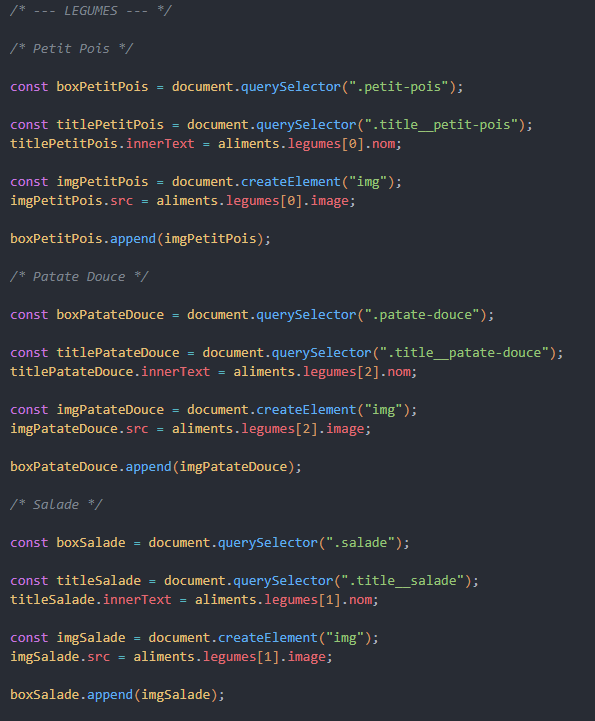
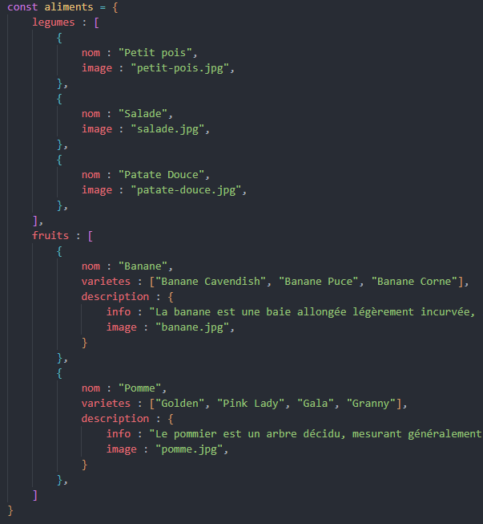

# Correction partie Légumes

On va prendre un exemple, celui de `salade`.

On voit dans notre HTML qu'il y a déjà la balise avec sa class :

`<h3 class="title__salade"></h3>` 

qui elle est dans une div :

`
`

Cool ! on va pouvoir la cibler directement.

Je sais qu'il va y avoir une image à créé, et qu'il faudra donc l'ajouter à la div.

Je vais donc cibler ma div :

`const boxSalade = document.querySelector(".salade")`

> Tu utilises une "const" ?

Oui, en général quand on récupére un élément qui est fixe dans le HTML, on ne veut surtout pas faire une erreur de manipulation par la suite et modifier sa valeur. Par précaution on utilise donc une `const`.

Maintenant ma div est prête, on va procéder dans l'ordre architectural de notre HTML. On a notre `<h3>` et il faut simplement ajouter le text dedans qui correspond à l'objet du fichier `data.js`.

On cible donc notre titre de troisiéme niveau :

`const titleSalade = document.querySelector(".title__salade");`

On sait comment ajouter un text avec `innerText` ou `textContent`, dans cet exemple on va utiliser `innerText` qu'on a l'habitude d'utiliser.

Par contre, voyons voir comment est implanté notre objet.

### Petite réfléxion

Je vois, `aliments` et notre entrée pour accéder à `legumes` et ` fruits` qui eux même sont des entrées pour accéder à d'autres objets.

Dans notre cas, on est sur `legumes`. On veut le titre, qui est donc `nom : "Salade"`

Donc si je suis le chemin qui me paraît logique, il faudrait faire:

`aliments` > `legumes` > `nom`

Mais !! il faut penser à lui indiquer dans lequel de ces 3 objets que possède `legumes`, on veut le `nom`.

On sait qu'on démarre toujours de l'index `0`. Certes, ma `Salade` est le troisième exercice, mais on a besoin de récupérer le second dans ce cas la.

L'objet `Petit pois` est l'index `0`, `Salade` est l'index `1` et `Patate Douce` l'index `2`. Cool, on a se qu'il nous faut maintenant.

### Reprenons

***INFO :** N'oublions pas que pour passer d'un élément à l'autre, on utilise le `.`*

Je vais pouvoir ajouter dans la valeur attendue de mon `innerText`, la valeur de l'objet ciblé qu'il nous faut, on en a déduit `aliments.legumes[1].nom`.

`titleSalade.innerText = aliments.legumes[1].nom;`

>Super ! je vois le titre `Salade` sur l'élément tout à droite de ma page.

Il nous manque l'image... Il faut cependant la créer car dans le HTML il n'y a rien.

`const imgSalade = document.createElement("img");`

On sait y ajouter l'attribut "src=" avec `.src, mais d'abord regardons où se trouve notre image, car il ne faut pas oublier qu'une image à son chemin aussi à suivre.

Ouff, elle est dans notre arborescence direct. Si on reprend notre fichier `data.js`, on voit qu'il y a bien une valeur dans `image`, qui en plus, possède déjà l'extension `.jpg` dans son nom.

Donc on va pouvoir l'ajouter à notre `.src` :

`imgSalade.src = aliments.legumes[1].image`

Rien ne se passe ? c'est normal. Plus qu'une étape, intégrer notre image dans notre HTML.

On a pensé à récupérer la `div` que l'on a mis dans une variable `boxSalade`.

Pour ajouter un élément dans notre HTMl, on sait qu'on doit utilisé `append`.

Quand on utilise `append` il faut retenir que l'on lit la phrase de droite à gauche, la valeur entre parenthèse à droite et ajouté dans celui à gauche, donc let's go :

`boxSalade.append(imgSalade)`

>YES !! mon image apparaît.

### Info correction

Pour les autres éléments s'est la même chose, sauf l'index à changer comme tu t'en doutes.

Si tu as réussi, bravo !! :)

Maintenant, corrigeons la partie fruits. Prêt ? gooo.

Par ici : [Correction partie Fruits](./Correction-fruits.exercices01.md)

