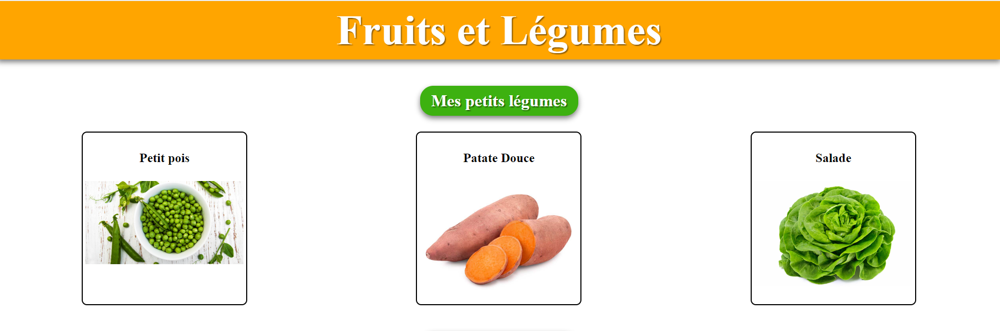
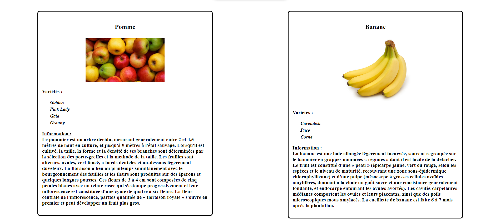

# Fruits et Légumes

## Prélude
Bonjour, tu es le nouveau stagiaire ?
> Bonjour, oui c'est bien moi.

Super, on a besoin de toi. J'avais vu sur ton CV que tu étais un habitué de Javascript et que les objets et la manipulation du DOM, ou la création d'élément dans le DOM ne te font pas peur.
> En effet, j'ai des bases, mais avec de la pratique je ne peux que m'améliorer. 

Top, tu tombes à pique alors.

## Info

La personne que tu remplaces avait fait le HTML et CSS. Sauf qu'en Javascript elle n'y connaissait absolument rien. Comme tu le vois, il manque beaucoup de chose sur le site.
L'avantage, s'est qu'il n'y à rien à toucher, tous se passe en Javascript dans le fichier `script.js`. Tu trouveras également un fichier appellé `data.js` dont tu auras besoin.

Tu as dû voir que beaucoup d'éléments sont déjà présents en HTML, chacun avec leur class prédéfini. 
> Oui en effet, je vois ça.

## Consigne

Tout le code à écrire se passe dans `script.js`.

La partie légume est la plus simple pour démarrer et te mettre dans le bain.

### Partie Légumes

- Ajoute le text du titre dans le `h3` à l'aide de `data.js`
- Créé et ajoute une image dans la div prévue à cet effet dans le HTML, portant le nom du légume concerné. Exemple :  `
`   

Par contre, il y a quelques consignes à respecter :

- Dans le fichier `script.js`, il y a déjà des commentaires fournis, avec le nom du légume ` /* Petit Pois */ `, il faudra respecter l'ordre dans le Javascript.
- Il faudrait éviter de trop copier/coller, le but est d'assimiler le cheminement pour réaliser la tâche, si tu as eu du mal à faire le premier légume, autant t'entrainer sur le second (*en faisait attention à l'ordre*), car le copier/coller dans ce cas-là ne t'apportera rien.
- Les images sont placées différemment, certains dans l'arborescence des dossiers avec le code (a ne pas reproduire) et d'autre bien rangé dans `assets`, ce n'est pas une erreur, mais un défi de plus pour toi pour le travail qui t'attend.

### Partie Fruits

Comme l'exercice précédent :
- Ajoute le titre dans le `h3`
- Créé et ajoute une image dans la div créée à cet effet et portant son nom : `

`
- Ajoute dans le `ul` déjà créé dans notre HTML, la list des variétés.
- Ajoute l'information dans la `span` créé à cet effet :  ``
- Fais bien attention, il y a quelques "pièges".

Je t'ajoute des images du rendu final (il n'y a pas de trait au milieu, ce sont juste 2 captures d'écran) :

## Compléments de consigne

Fais très attention à la partie fruits qui est le plus "compliqué", beaucoup de chose à faire et beaucoup de petit piège. Surtout vas y pas à pas !!

Puis, il y a peut-être un petit malin qui a mis un piége quelques parts dans la partie `Fruits`, surveille bien le rendu.

Ne t'inquiète pas, tu n'as besoin de coder et d'intervenir que dans le fichier `script.js`

## Mot de la fin

J'ai voulu faire un code simple avec des class explicites (français), je l'ai donc créé pour surtout se concentrer sur les objets (récupération de donnée).
Je suis moins inspirer par des noms en FR qu'en EN lol.

S'il n'y a aucun accent, c'est normal, comme on le sait, les noms de variables, class, id, etc... ne doivent pas avoir d'accent, cela évitera pas mal d'erreur (y compris lors des noms de repo github si vous voulez mettre en ligne). C'est pour ça que je préfère l'anglais niveau nommage, mais je voulais rester le plus "clair" possible.

Si tu réussis ce travail, il ce peut que j'en ai d'un peu plus difficile par la suite pour toi sur les objets, quand j'aurais un peu de temps libre, donc si tu réussis ceux-là, t'auras déjà franchis un cap et j'espère que ça t'aidera à mieux comprendre le cheminement.

## Bon code

Bon courage, donne-toi à fond et surtout prend ton temps :)